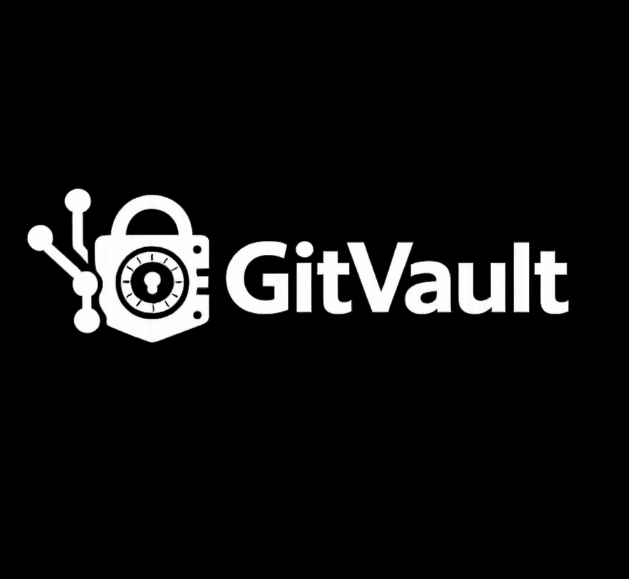

<p align="center">
  
</p>

<p align="center">
  <strong>Smart file storage backed by your GitHub repositories.</strong><br/>
  <em>Almacenamiento de archivos inteligente respaldado por tus repositorios de GitHub.</em>
</p>

<p align="center">
  Built by <a href="https://dudiver.net">Roberth Dudiver</a>
</p>

---

## What is GitVault?

GitVault turns your GitHub repositories into a personal file storage service — with public/private URLs, API access, and a clean web dashboard.

Instead of paying for S3 or Cloudinary, your files live in **your own GitHub repos**, using GitHub as the actual storage backend. GitVault provides the metadata layer, serving infrastructure, and developer API on top.

---

## Features

- **Upload & serve files** — drag-and-drop uploader, public or private visibility per file
- **Pretty URLs** — `/f/{publicId}/{filename.ext}` served via API or GitHub's CDN
- **API access** — create apps with scoped API keys (`files:read`, `files:write`) to integrate GitVault into your projects
- **Folder organization** — organize files inside vaults
- **GitHub App integration** — connect your GitHub account via OAuth App or Personal Access Token
- **Admin panel** — manage users, block/unblock accounts
- **Open source** — full source code available, self-hostable

---

## Tech Stack

| Layer | Technology |
|---|---|
| API | ASP.NET Core 10 (C#) |
| Database | SQLite + Entity Framework Core |
| Cache | Redis |
| Auth | Firebase Authentication |
| Storage backend | GitHub (via Octokit.net) |
| Frontend | Next.js 15 (TypeScript, Tailwind CSS) |
| API docs | Scalar (OpenAPI) |
| Deployment | Docker + GitHub Actions |

---

## Architecture

```
Browser / Client
      │
      ▼
  Next.js (web)              ← Dashboard UI
      │
      ▼
  ASP.NET Core API           ← REST API + serving layer
      │           │
      ▼           ▼
   SQLite      Redis         ← Metadata + cache
      │
      ▼
  GitHub API                 ← Actual file storage (your repo)
```

Files are stored as binary blobs inside a GitHub repo under `objects/{sha[0:2]}/{sha[2:4]}/{sha256}` (content-addressable, deduplication built-in).
Public files are served directly from GitHub's CDN (`raw.githubusercontent.com`) — zero rate-limit cost.
Private files are streamed through the API with authentication.

---

## Self-Hosting

### Requirements

- Docker + Docker Compose
- A GitHub App (for repo creation) or a GitHub Personal Access Token
- A Firebase project (for authentication)
- A domain with SSL (nginx reverse proxy recommended)

### Quick Start

```bash
git clone https://github.com/RoberthDudiver/GitVault.git
cd GitVault/infra
cp docker-compose.prod.example.yml docker-compose.yml
# Edit docker-compose.yml with your values
docker compose up -d
```

### Environment Variables

| Variable | Description |
|---|---|
| `SQLITE_PATH` | Path to the SQLite database file |
| `SERVER_SECRET` | Secret key for HMAC signing and AES encryption |
| `FIREBASE_CREDENTIAL_JSON` | Firebase Admin SDK credentials (JSON) |
| `GITHUB_APP_ID` | GitHub App ID |
| `GITHUB_APP_NAME` | GitHub App slug name |
| `GITHUB_APP_PRIVATE_KEY` | GitHub App private key (PEM) |
| `FRONTEND_URL` | URL of the Next.js frontend |
| `ADMIN_SECRET` | Secret for the admin panel (`/admin`) |
| `Redis__ConnectionString` | Redis connection string |

See `infra/docker-compose.prod.example.yml` for a complete example.

---

## API

Interactive API documentation is available at `/scalar/v1` when the API is running.

### Authentication

All API endpoints require a Firebase Bearer token:
```
Authorization: Bearer <firebase-id-token>
```

App API access uses HTTP Basic:
```
Authorization: Basic base64(api_key:api_secret)
```

### Key Endpoints

```
GET    /v1/vaults                          List vaults
POST   /v1/vaults                          Connect or create vault
GET    /v1/vaults/{vaultId}/files          List files
POST   /v1/vaults/{vaultId}/files          Upload file (max 10 MB)
POST   /v1/vaults/{vaultId}/files/batch    Batch upload (max 20 files, 100 MB)
PATCH  /v1/vaults/{vaultId}/files/{id}     Update visibility / name
DELETE /v1/vaults/{vaultId}/files/{id}     Delete file
GET    /f/{publicId}/{filename}            Serve file (public URL)
```

---

## Contributing

Contributions are welcome under the project license:

1. Fork the repository
2. Create a feature branch (`git checkout -b feat/my-feature`)
3. Make your changes
4. **Submit a Pull Request** to the original repository

> Functional changes **must** be submitted as a PR. Please do not distribute modified versions without contributing back.

---

## License

This project is licensed under a **Custom Non-Commercial Open Source License**.

- ✅ Free to use for personal, non-commercial purposes
- ✅ Study and modify the code
- ✅ Self-host for personal use
- ❌ Commercial use without written authorization
- ❌ Selling or sublicensing without authorization
- ⚠️ Functional changes must be submitted as a Pull Request
- 📌 Attribution to the original author is required in all copies

See the full [LICENSE](./LICENSE) file for details.

For commercial licensing: [dudiver.net](https://dudiver.net)

---

## Legal

- [Terms of Service](https://gitvault.dudiver.net/terms)
- [Privacy Policy](https://gitvault.dudiver.net/privacy)

The software is provided "as is" without warranty. The author is not responsible for misuse, data loss, or any damages arising from use of this software.

---

<p align="center">
  Built with ❤️ by <a href="https://dudiver.net">Roberth Dudiver</a>
</p>
